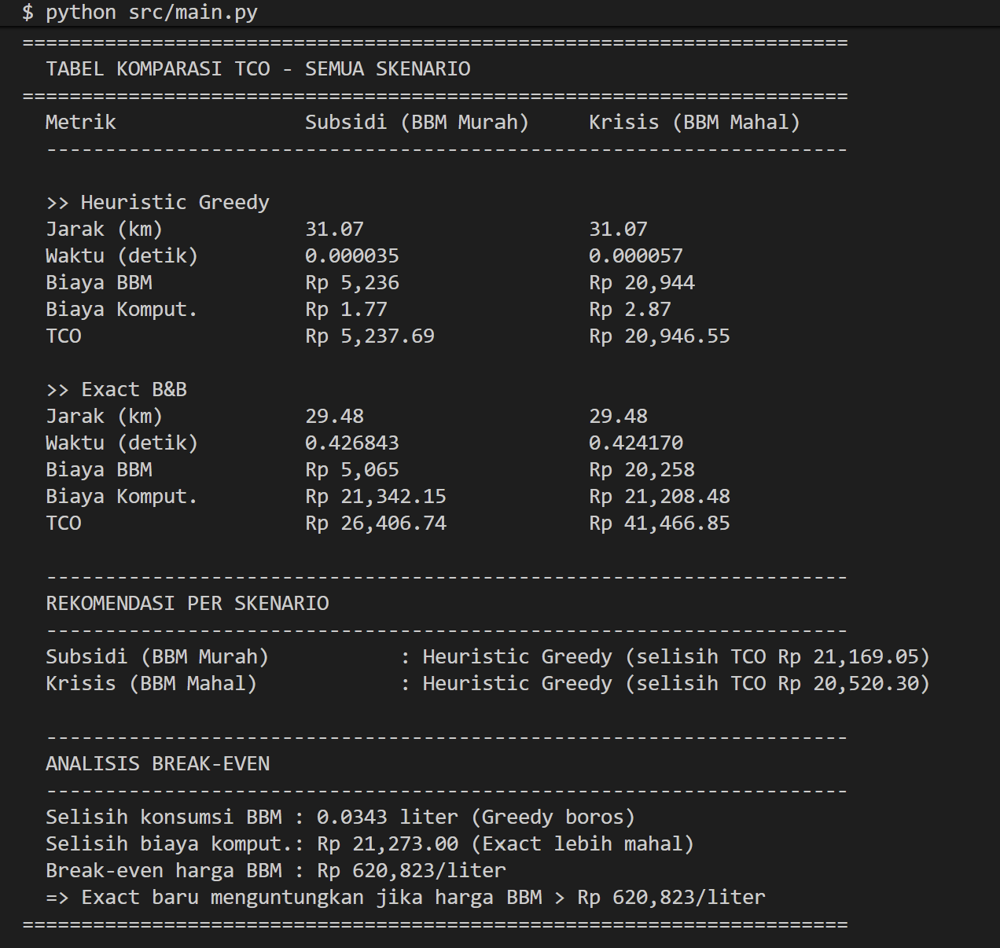
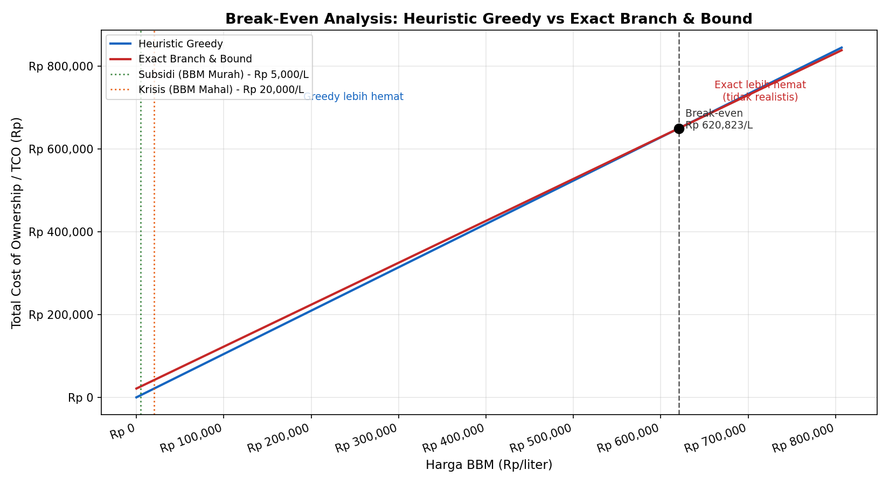

# TCO Analysis: Last-Mile Delivery Route Simulator

Proyek ini mensimulasikan dua pendekatan algoritma pencarian rute kurir dan membandingkan total biaya operasionalnya pada dua kondisi harga BBM yang berbeda. Tujuannya sederhana: membuktikan secara angka, bukan hanya teori, kapan algoritma yang lebih mahal secara komputasi benar-benar worth it.

---

## 1. Cara Menjalankan Program

### Yang dibutuhkan
- Python 3.8 ke atas
- Koneksi internet (dipakai sekali untuk mengambil data jarak via OSRM API)

### Instalasi dependensi
```bash
pip install -r requirements.txt
```

### Langkah 1: Generate matriks jarak (cukup sekali)

Sebelum simulasi bisa dijalankan, koordinat lokasi di `data/lokasi.json` perlu dikonversi dulu menjadi matriks jarak nyata antar titik (dalam km). Proses ini memanggil OSRM API dan menyimpan hasilnya ke `data/generated/graph.csv`.

```bash
python src/main.py --calculate-graph
```

Langkah ini hanya perlu diulang kalau ada perubahan lokasi di `lokasi.json`.

### Langkah 2: Jalankan simulasi

**Untuk melihat perbandingan lengkap kedua skenario sekaligus (ini yang paling informatif):**
```bash
python src/main.py
```

**Atau kalau mau jalankan satu skenario saja:**
```bash
python src/main.py --scenario subsidi
python src/main.py --scenario krisis
```

Program akan menampilkan urutan rute, jarak tempuh, waktu eksekusi tiap algoritma, rincian biaya BBM dan komputasi, serta TCO. Kalau dijalankan tanpa `--scenario`, ada tabel perbandingan lintas skenario, analisis break-even di terminal, dan grafik break-even yang otomatis tersimpan ke `docs/breakeven_chart.png`.

---

## 2. Kenapa Algoritma Ini yang Dipilih?

### Algoritma A: Nearest Neighbor Greedy (Heuristik)

Cara kerjanya intuitif: dari hub, kurir selalu bergerak ke pelanggan terdekat yang belum dikunjungi, sampai semua selesai, lalu balik ke hub.

Alasan dipilih sebagai algoritma heuristik:
- Mudah dipahami dan diimplementasikan dari nol tanpa library eksternal
- Kompleksitas O(n²) artinya tetap cepat meskipun jumlah pelanggan bertambah
- Ini adalah pendekatan greedy paling umum dipakai di industri logistik sebagai baseline

Kelemahannya: tidak ada garansi rute optimal. Hasilnya bisa 15-25% lebih panjang dari rute terbaik, tergantung bagaimana titik-titik pelanggan tersebar.

### Algoritma B: Branch and Bound dengan Lower Bound Pruning (Eksak)

Cara kerjanya: eksplorasi semua kemungkinan urutan kunjungan secara rekursif. Bedanya dengan brute force, setiap cabang yang sudah dipastikan tidak akan menghasilkan solusi lebih baik langsung dipotong (pruning), sehingga tidak perlu diteruskan.

Alasan dipilih sebagai algoritma eksak:
- Menjamin rute yang benar-benar optimal, bukan sekadar estimasi
- Pruning adaptif membuat B&B jauh lebih cepat dari brute force pada dataset kecil-menengah (n <= 15)
- Implementasi rekursif dari nol cukup straightforward dan transparan untuk diaudit

Kelemahannya: saat jumlah pelanggan melewati sekitar 20 titik, waktu eksekusinya mulai meledak secara eksponensial.

---

## 3. Analisis Kompleksitas (Big-O)

| Algoritma | Waktu Terburuk | Waktu Praktik | Memori |
|---|---|---|---|
| Nearest Neighbor Greedy | O(n²) | O(n²) | O(n) |
| Branch and Bound | O(n!) | Lebih baik dengan pruning | O(n²) untuk stack rekursi |

**Bagaimana angka ini didapat:**

Greedy punya dua loop bersarang: satu untuk iterasi tiap pelanggan (n kali), satu lagi untuk mencari yang terdekat di antara yang belum dikunjungi (n kali juga). Hasilnya O(n²).

```
for setiap pelanggan (n iterasi):
    for setiap pelanggan belum dikunjungi:  # n iterasi juga
        hitung jarak ke posisi sekarang     # O(1)
Total: O(n²)
```

Branch and Bound bekerja rekursif. Di setiap level rekursi ada n pilihan cabang, masing-masing menghitung lower bound dalam O(n), dan kedalaman rekursi maksimal adalah n. Worst case-nya O(n! x n²), tapi pruning memotong banyak cabang sehingga waktu aktual jauh lebih kecil.

```
_backtrack(posisi_sekarang, sudah_dikunjungi, rute, jarak):
    for setiap pelanggan yang belum dikunjungi:  # O(n) cabang
        hitung lower_bound sisa perjalanan       # O(n)
        kalau masih berpotensi lebih baik: rekursi
Kedalaman rekursi maksimal: n
Worst case sebelum pruning: O(n! x n²)
```

Dengan n = 12 pelanggan: Greedy selesai dalam sekitar 0.00005 detik, B&B membutuhkan sekitar 0.5 detik.

---

## 4. Kesimpulan Bisnis

### Hasil simulasi



| | Skenario Subsidi (Rp 5.000/L) | Skenario Krisis (Rp 20.000/L) |
|---|---|---|
| Greedy - jarak | 31.07 km | 31.07 km |
| Greedy - TCO | Rp 5.237 | Rp 20.946 |
| Exact B&B - jarak | 29.48 km | 29.48 km |
| Exact B&B - TCO | Rp 26.406 | Rp 41.466 |
| Rekomendasi | **Greedy** | **Greedy** |

### Apa yang bisa disimpulkan

Di kedua skenario, Greedy menang secara TCO dengan selisih yang sangat besar.

Memang benar bahwa B&B menghasilkan rute yang lebih pendek, sekitar 5% lebih efisien (29.48 km vs 31.07 km). Tapi penghematan BBM dari selisih jarak itu hanya sekitar Rp 171 di skenario subsidi dan Rp 686 di skenario krisis. Sementara biaya komputasi server untuk menjalankan B&B dengan sistem pay-as-you-go Rp 50/ms mencapai sekitar Rp 21.000 per pengiriman. Tidak sebanding sama sekali.

### Titik Break-Even

Pertanyaan yang lebih menarik bukan "algoritma mana yang lebih baik", tapi "pada harga BBM berapa algoritma eksak mulai worth it?". Grafik di bawah ini menjawabnya secara visual.



Kedua garis di grafik adalah fungsi linear dari harga BBM:
- **Garis biru (Greedy):** TCO rendah di awal karena biaya komputasinya hampir nol, tapi naik lebih cepat karena rutunya lebih boros BBM
- **Garis merah (B&B):** TCO mulai jauh lebih tinggi karena biaya server yang besar, tapi kemiringannya lebih landai karena rutunya lebih hemat BBM

Perpotongan kedua garis adalah titik break-even, yang bisa dihitung langsung:

```
Selisih konsumsi BBM     : 0.0343 liter (Greedy lebih boros)
Selisih biaya komputasi  : Rp 21.273 (B&B lebih mahal)

Harga BBM break-even = Rp 21.273 / 0.0343 liter = sekitar Rp 620.000/liter
```

B&B baru lebih menguntungkan kalau harga BBM melampaui angka itu. Angka yang jelas tidak akan terjadi dalam kondisi ekonomi manapun yang masuk akal, termasuk skenario krisis sekalipun.

### Rekomendasi akhir

Pertahankan Greedy untuk operasional harian. Investasi ke algoritma eksak baru layak dipertimbangkan kalau infrastruktur komputasi berubah secara fundamental, misalnya pindah ke on-premise server dengan biaya tetap, sehingga biaya komputasi per milidetik tidak lagi relevan. Selain itu, jumlah pelanggan per rute juga perlu jauh lebih banyak agar penghematan jarak dari B&B terasa signifikan secara finansial.
